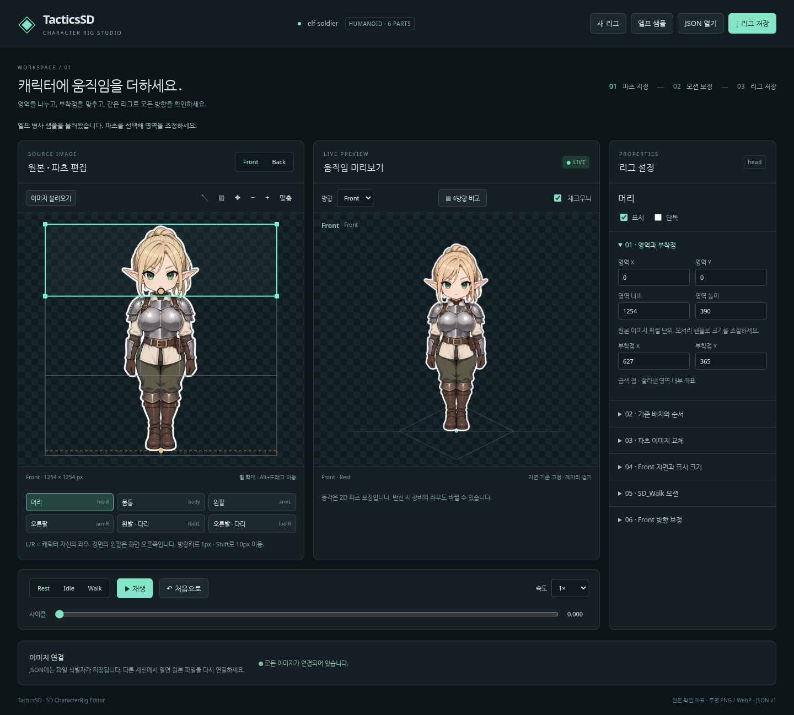

# TacticsSD · Character Rig Studio

앞·뒷면 SD 캐릭터 이미지의 **6개 파츠를 지정하고 Rest / Idle / Walk와 등각 4방향을 실시간으로 확인하는 브라우저 에디터**입니다. [Issue #1](https://github.com/darkbard81/TacticsSD/issues/1)의 독립 실행형 MVP입니다.



## 실행

Node.js **24 이상**과 npm을 사용합니다. TypeScript 5.9.3, Vite 8.3.1, PixiJS 8.21.0을 잠금 파일로 고정했습니다.

```sh
npm ci
npm run dev
```

개발 주소는 기본 `http://localhost:5173`입니다. 파일은 브라우저에서 로컬로 처리합니다. 별도 API 서버나 로그인은 필요하지 않습니다.

```sh
npm run build
npm run preview
```

빌드 결과는 `dist/`에 생성됩니다. 프로덕션 미리보기는 기본 `http://localhost:4173`입니다. 정적 호스팅 시 `dist/` 전체를 웹 루트에 배치합니다.

## 작업 흐름

1. **엘프 샘플**로 시작하거나 **새 리그 → 이미지 불러오기**를 선택합니다. Front / Back 각각 PNG 또는 WebP를 지정합니다. 한쪽만 있어도 편집됩니다.
2. 머리·몸통·양팔·양발 중 선택합니다. ↖ 도구로 영역 이동, ▧ 도구로 새 사각형 지정, 모서리 핸들로 크기를 변경합니다. 속성의 수치 입력도 즉시 반영됩니다.
3. 금색 점을 드래그하거나 수치로 **부착점**을 조정합니다. 부착점은 잘라낸 영역 내부 픽셀 좌표입니다. L/R은 캐릭터 본인의 좌우이므로 정면의 왼팔은 화면 오른쪽입니다.
4. 기준 배치, 표시·단독 보기, 그리기 순서를 조정합니다. 숫자가 큰 파츠를 나중에 그립니다. **배치 초기화**는 현재 영역과 부착점으로 Rest 위치를 복원합니다.
5. **지면 X/Y, 기준 크기, 표시 배율**로 크기와 여백이 다른 Front/Back의 발밑과 표시 크기를 맞춥니다. Front 설정을 Back으로 비례 복사할 수 있지만, 후면에 맞게 수정해야 합니다.
6. Rest / Idle / Walk를 선택하고 재생·일시정지, 속도, 사이클 슬라이더를 사용합니다. **처음으로**는 재생을 멈추고 Rest / 0초로 돌아갑니다. 방향이나 뷰 변경은 현재 시간을 보존합니다.
7. Front / Back / SE / SW / NE / NW 또는 **4방향 비교**로 확인합니다. 속성에서 현재 방향의 이미지 계열, 반전, 보행 벡터, 좌우 모션 매핑, 팔 회전 부호 및 선택 파츠 위치·배율·skew·회전·순서를 수정합니다.
8. **리그 저장**으로 JSON을 내려받습니다. 이미지 파일도 보관하세요. 새 세션에서 JSON을 열면 하단의 **이미지 연결**로 원본/교체 이미지를 연결합니다. 파일명이 같으면 일괄 연결하고, 이름이 다르면 개별 연결합니다. 연결 시 크기를 검증합니다.

확대/축소는 휠 또는 ± 버튼, 화면 이동은 ✥ 또는 Alt+드래그, 선택 영역 이동은 방향키(Shift: 10px)입니다. 파일 버튼도 Tab 및 Enter/Space로 사용할 수 있습니다. 숫자 입력 오류는 현재 유효한 리그를 유지하며 알립니다.

동일 크기의 원본 이미지 교체는 영역을 유지합니다. **다른 크기로 교체하면 해당 뷰의 파츠 설정을 초기화**합니다. 잘못된 JSON이나 이미지 해석 실패는 현재 프로젝트를 보존합니다. 새 리그/샘플/정상 JSON 열기는 현재 프로젝트를 교체하므로 필요한 작업은 먼저 저장하세요. 페이지를 떠날 때 저장하지 않은 수정이 있으면 브라우저 경고가 표시됩니다.

## 샘플과 사각형 추출의 한계

`public/samples/elf-front.png`, `elf-back.png`는 이 프로젝트를 위해 생성한 성인 엘프 여성 병사 스탠디입니다. **1254×1254 RGBA, 투명 배경, 흰색 외곽선**이며 후면은 정면을 참조해 제작했습니다. 생성 원본과 프롬프트는 `output/imagegen/elf-soldier/`에 있습니다.

초기 영역은 원본 전체를 겹침 없이 6개 사각형으로 나눕니다. Rest에서는 원래 그림이 복원되지만, 팔에 인접한 몸통이나 허리 픽셀이 같은 영역에 들어갑니다. Walk에서 경계의 절단·틈 또는 함께 움직이는 픽셀이 보일 수 있습니다. 이는 완성된 단일 그림을 사각형으로 자르는 한계입니다. 가려진 몸통이나 옆면을 자동 생성하지 않습니다.

파츠별 **PNG / WebP 교체**로 외부에서 정리한 투명 이미지를 사용할 수 있습니다. 이미지는 해당 파츠의 영역 크기에 맞춰 표시되고 같은 pivot/배치/모션을 사용합니다. 복잡한 마스크, 자동 분할, 인페인팅은 제공하지 않습니다. 분리 가능한 6색 테스트 원본에서 실제 Pixi 재조합 픽셀을 원본과 비교하는 별도 검증을 포함합니다.

등각 미리보기는 2D 반전과 파츠별 보정입니다. 실제 3D 회전이나 새로운 측면 그림을 만들지 않습니다. 비대칭 장비는 반전에 따라 좌우가 바뀝니다. 원하는 경우 3/4 원화로 교체하고 방향 프리셋을 조정하세요.

## 데이터와 좌표

- `src/domain/rig.ts`: `CharacterRigData`, 버전 1 스키마, 이미지 식별자, Front/Back 독립 파츠/지면/표시 배율, 템플릿 정의, 검증 및 직렬화.
- `src/domain/animator.ts`: `MotionPreset`, `DirectionPreset`을 사용하는 순수 시간 평가. Pixi나 DOM에 의존하지 않습니다.
- `src/runtime/renderer.ts`: `PixiRigRenderer`. 평가 결과를 root → part pivot Container → Sprite에 적용합니다.
- `src/runtime/assets.ts`: 로컬 이미지 디코딩, TextureSource 및 object URL 소유/해제, 누락 이미지 목록.
- `src/editor/source.ts`, `src/main.ts`: DOM/SVG 원본 편집과 DOM 속성 UI. 미리보기는 동일한 런타임을 사용합니다.

영역은 원본 픽셀, pivot은 파츠 내부 픽셀입니다. 최초 rest anchor는 `rect 위치 + pivot - ground`입니다. 영역/pivot 수정 시 사용자 배치 오프셋을 유지하며 anchor를 갱신합니다. DPR과 편집기 확대율은 저장 데이터에 포함되지 않습니다.

모션 이동량은 뷰의 `referenceSize`에 대한 비율입니다. 표시 크기는 공통 가상 크기 1254에 정규화한 뒤 `displayScale`을 적용합니다. 방향 파츠 이동 보정은 1254 기준 단위입니다. 회전과 skew는 라디안입니다. root의 위치/배율/반전과 파츠의 Rest + 방향 + 모션 합성을 분리하며 프레임 간 변형을 누적하지 않습니다.

`SD_Walk` 한 사이클은 양발 각 한 번입니다. 접지에서는 전후 이동, 스윙에서는 복귀와 별도 발 들기를 적용합니다. 같은 쪽 팔은 발과 반대 위상입니다. 몸통 바운스는 한 사이클에 두 번입니다. 깊이는 들기와 별개이고 발끼리의 작은 순서 보정에만 사용합니다. 화면 Y로 전 파츠 순서를 재계산하지 않습니다. 발 크기 변화의 기본값은 0입니다.

JSON은 이미지 파일명/ID와 크기를 저장하고 이미지 바이너리, Pixi 객체, 일시적인 `blob:` URL은 포함하지 않습니다. Front/Back 원본, 교체 이미지, 모션/방향 설정을 모두 복원합니다. 거인은 동일 구조에서 비율과 모션 값을 바꿉니다. 다른 체형은 템플릿 레지스트리와 평가기 확장 지점만 준비되어 있으며 현재 지원은 Humanoid 6파츠입니다.

## 검증

```sh
npm run check
npm test
npx playwright install chromium
npm run test:browser
npm run build
```

Linux CI에서 브라우저 시스템 패키지가 필요하면 `npx playwright install --with-deps chromium`을 사용합니다. `npm run test:all`은 도메인과 브라우저 테스트를 순서대로 실행합니다. GitHub Actions는 push/PR에서 설치·타입 검사·빌드·두 테스트 계층을 실행합니다.

[요구사항별 검증 기록](docs/validation.md)에서 테스트와 실제 샘플의 제약을 확인할 수 있습니다.

공식 API 참고: [PixiJS Ticker](https://pixijs.com/8.x/guides/components/ticker), [Container](https://pixijs.com/8.x/guides/components/scene-objects/container).
