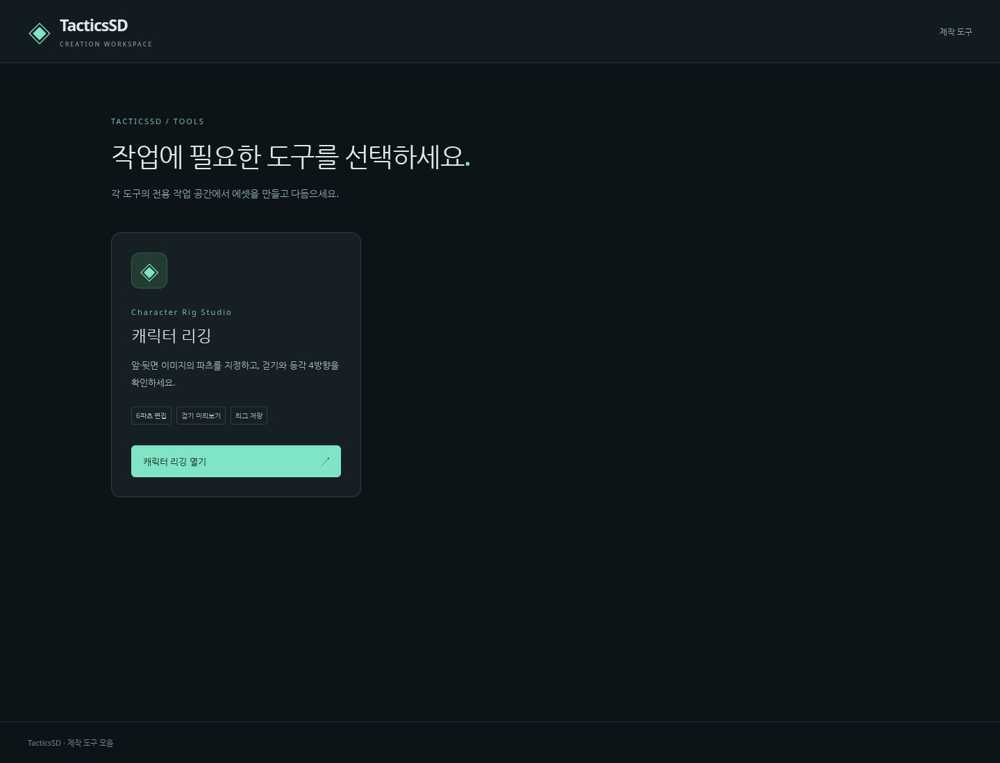

# TacticsSD

TacticsSD의 제작 도구 모음입니다. 메인 화면에서 도구를 선택해 전용 작업 화면으로 이동합니다.

## 실행

Node.js **24 이상**과 npm을 사용합니다. 저장소 루트에서 실행하세요.

```sh
npm ci
npm run tool
```

`http://localhost:5173`에서 메인 화면이 열립니다. **캐릭터 리깅 열기** 버튼을 누르면 리깅 에디터로 이동하고, 에디터의 **메인으로** 버튼으로 돌아옵니다.

- 메인 화면: `/`
- 캐릭터 리깅: `/tools/characterRig/` — 직접 접속과 새로고침도 지원합니다.
- 기존 `npm run dev`는 `npm run tool`의 별칭입니다.

```sh
npm run build
npm run preview
```

프로덕션 미리보기는 `http://localhost:4173`입니다. 메인과 각 툴의 HTML을 개별 빌드하므로 정적 호스팅에는 `dist/` 전체를 배치하세요.



## 도구

| 도구 | 내용 | 위치 |
| --- | --- | --- |
| Character Rig | 앞·뒷면 6파츠 리깅, Idle/Walk, 등각 4방향, JSON 저장·복원 | [tools/characterRig](tools/characterRig/README.md) |

캐릭터 리깅은 제공된 엘프 **파츠 시트 1장**을 기본으로 사용합니다. 투명 배경 파생 이미지와 앞·뒤 조립 프리셋이 포함되어 바로 Rest / Idle / Walk를 확인할 수 있습니다. 후면 팔은 원본의 공용 팔을 재사용합니다. [자세한 사용법](tools/characterRig/README.md)과 [검증 기록](tools/characterRig/docs/validation.md)을 참고하세요.

## 구조

```text
src/                        메인 화면만 담당
  main.ts
  style.css
tools/
  registry.ts               메인 도구 목록과 빌드 진입점 등록
  characterRig/
    index.html              리깅 툴 전용 페이지
    main.ts / style.css     리깅 UI
    domain/                 리그 데이터, 좌표, 모션
    editor/ / runtime/      원본 편집과 Pixi 렌더러
    assets/                 샘플 이미지와 생성 원본
    tests/                  리깅 도메인·브라우저 검증
    docs/ / scripts/        리깅 문서·화면 기록
tests/browser/              메인 ↔ 도구 화면 이동 검증
```

새 도구는 `tools/<toolId>/index.html` 및 전용 코드를 만들고 `tools/registry.ts`에 등록합니다. 메인 목록과 프로덕션 빌드 진입점에 함께 반영됩니다. 메인 화면은 툴의 실행 코드나 Pixi 렌더러를 불러오지 않습니다. 도구 간 CSS도 각 페이지에서 독립적으로 로드합니다.

## 검증

```sh
npx playwright install chromium
npm run verify
```

이 프로젝트는 **로컬 `npm run verify` 결과를 CI 테스트 결과로 간주**합니다. 타입 검사 → 프로덕션 빌드 → 도메인 테스트 → Chromium 브라우저 테스트를 실행하며, GitHub Actions 워크플로는 사용하지 않습니다. 추가 Actions 설정은 필요하지 않습니다.

`npm run test:all`은 도메인·브라우저 테스트만 실행합니다. 브라우저 검증 서버도 `npm run tool`로 시작합니다.
